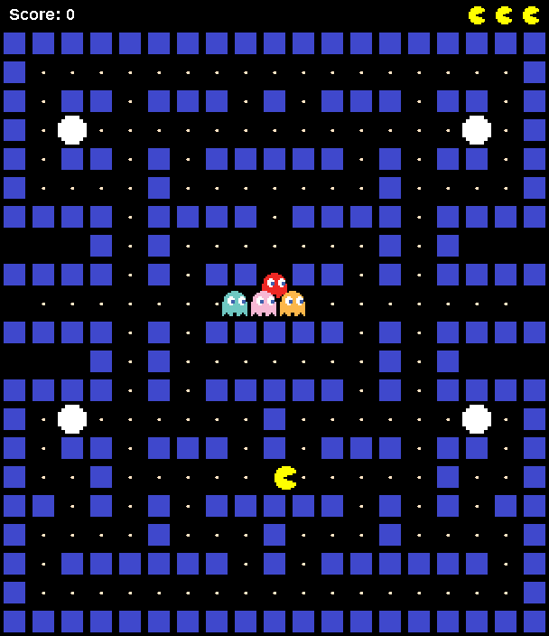

# Pacman

A complete Pac-Man clone written in Java (Swing/AWT) with pixel-art sprites,
four ghosts, power pellets, tunnels, lives and score.



[](https://github.com/suvrathkesaraju-lgtm/Pacman/actions/workflows/build.yml)
[](https://github.com/suvrathkesaraju-lgtm/Pacman/releases/latest)

## Download

Every release ships self-contained builds (no Java installation needed) plus a
portable JAR for any platform. See the
[latest release](https://github.com/suvrathkesaraju-lgtm/Pacman/releases/latest).

| Platform | File | Notes |
| --- | --- | --- |
| Windows 10/11 x64 | `Pacman-Windows-x64.msi` | Installer with Start Menu shortcut |
| Windows 10/11 x64 | `Pacman-Windows-x64.zip` | Portable, run `Pacman.exe` |
| macOS (Apple silicon) | `Pacman-macOS-arm64.dmg` / `.zip` | |
| macOS (Intel) | `Pacman-macOS-x64.dmg` / `.zip` | |
| Linux x64 | `Pacman-Linux-x64.deb` / `.rpm` | Installs to `/opt/pacman` |
| Linux x64 | `Pacman-Linux-x64.tar.gz` | Portable, run `./Pacman/bin/Pacman` |
| Any OS with Java 17+ | `Pacman.jar` | `java -jar Pacman.jar` |

> The macOS builds are not code-signed. On first launch, right-click the app and
> choose **Open**, or run `xattr -cr /Applications/Pacman.app`.

## Controls

| Key | Action |
| --- | --- |
| Arrow keys or WASD | Move |
| P | Pause / resume |
| Space | Restart after a game over or a win |

## Gameplay

- Eat every pellet to clear the maze. Regular pellets are worth 10 points.
- Power pellets (the big ones) are worth 50 points and turn the ghosts blue for
  six seconds. Eat blue ghosts for 200, 400, 800 and 1600 points.
- You have three lives. Touching a normal ghost costs one life; at zero lives
  it's game over.
- The side tunnels wrap around the maze.

## Build from source

Requires JDK 17 or newer (tested with JDK 21 and 27).

Linux/macOS:

```bash
./build.sh
java -jar build/Pacman.jar
```

Windows (PowerShell):

```powershell
mkdir build\classes
javac -d build\classes src\*.java
copy src\*.png build\classes
jar --create --file build\Pacman.jar --main-class App -C build\classes .
java -jar build\Pacman.jar
```

Run the headless smoke test (constructs the game, renders a frame and lets the
game loop run without a display):

```bash
javac -cp build/Pacman.jar -d build/test-classes test/SmokeTest.java
java -Djava.awt.headless=true -cp build/Pacman.jar:build/test-classes SmokeTest
```

### Native installers with jpackage

Release builds are produced with `jpackage`. To build an installer for the OS
you are on, first create `build/jpackage-input` containing a copy of
`build/Pacman.jar`, then run:

```bash
# Linux .deb (also supports .rpm and app-image)
jpackage --type deb --name pacman --app-version 1.0.0 \
  --input build/jpackage-input --main-jar Pacman.jar --main-class App \
  --icon assets/icon.png --linux-shortcut --dest dist

# macOS .dmg
jpackage --type dmg --name Pacman --app-version 1.0.0 \
  --input build/jpackage-input --main-jar Pacman.jar --main-class App \
  --icon assets/icon.icns --dest dist

# Windows .msi (requires WiX Toolset 3.x on the PATH)
jpackage --type msi --name Pacman --app-version 1.0.0 ^
  --input build\jpackage-input --main-jar Pacman.jar --main-class App ^
  --icon assets\icon.ico --win-shortcut --win-menu --dest dist
```

Regenerate the launcher icons from the sprite with
`python3 scripts/make-icons.py` (requires ImageMagick).

## Project structure

```
src/            Java sources and pixel-art sprites
test/           Headless smoke test
assets/         Launcher icons and README screenshot
scripts/        Icon generation script
build.sh        Compiles src/ into build/Pacman.jar
.github/        CI workflow: builds all platforms, publishes releases on tags
```

## Releases

[`.github/workflows/build.yml`](.github/workflows/build.yml) builds the game on
every push and pull request for Windows, macOS (arm64 and x64) and Linux.
Pushing a tag such as `v1.0.0` builds the platform installers, portable archives
and the universal JAR, then publishes them as a GitHub release.
